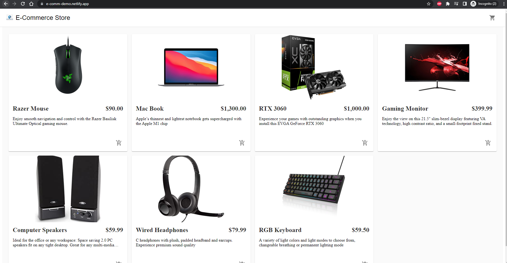
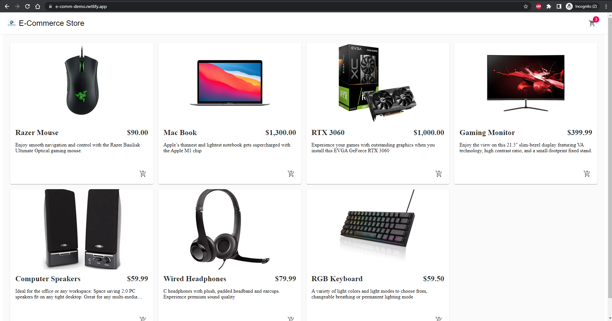
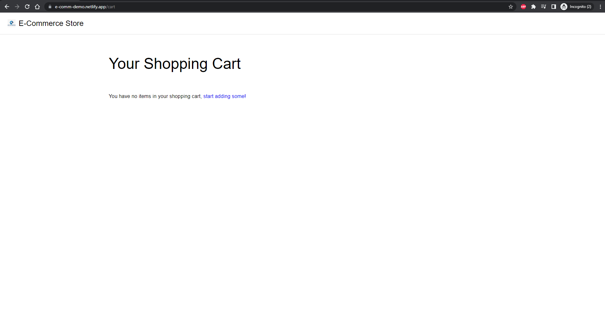
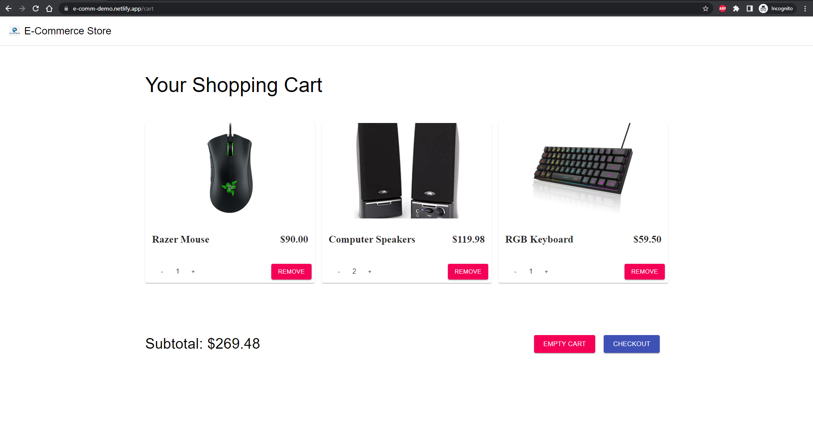
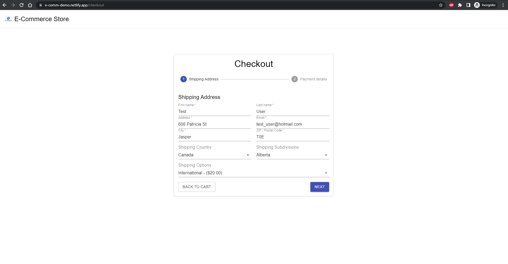
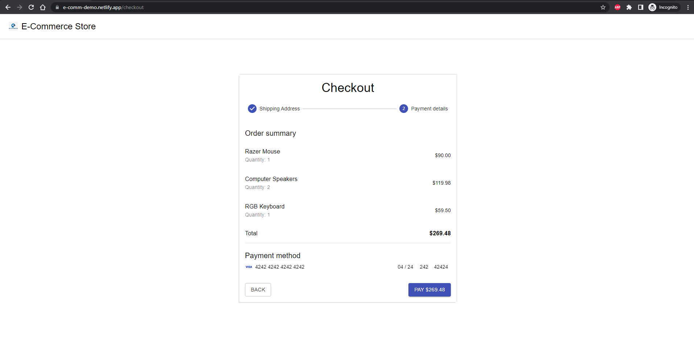
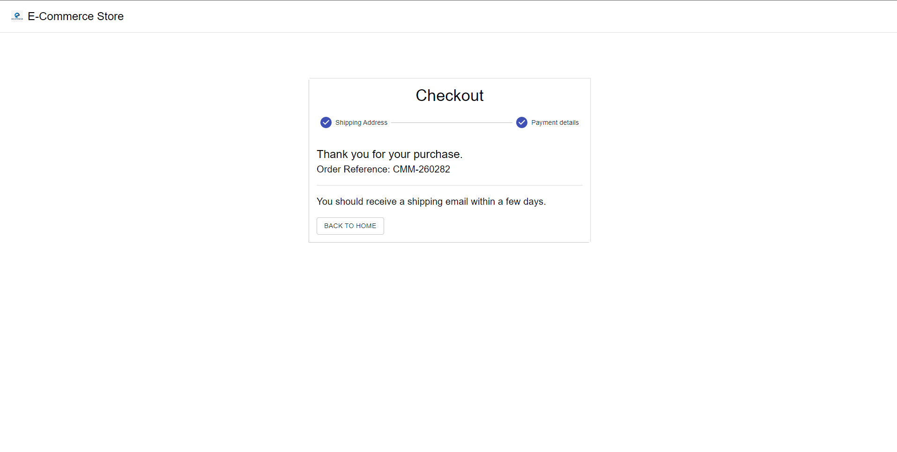

# Ecommerce Site

Table of Contents
1. [Introduction](##Introduction)
2. [Project Features and Screen Shots](Project-Features-and-Screen-Shots)
3. [Installation and Setup Instructions](##Setup-Local-Development-Environment)
   - [Requirements](###Requirements)
   - [First Time Installation](###First-Time-Installation)
   - [Run App Locally](###Instructions-to-run-the-app-in-development-mode)

## Introduction

This is a personal project featuring an Ecommerce site that is both web and mobile friendly. A live demo is hosted on Netlify (https://e-comm-demo.netlify.app/).

## Project Features and Screen Shots
#### Products Catalogue :
Application dynamically displays product details retrieved from commercejs API. The products are managed on commercejs's web interface.
 

#### Adding items to cart :
Users can add an item to their cart by clicking on the add to cart icon below each item's description. The shopping cart icon on the top right corner displays the number of items in the user's cart and immediately updates itself when a new item is added to their cart. Items added to cart are retained, allowing users to leave site and resume previous sessions when they return.


#### Empty Cart Message :
If the user's cart is empty, the cart page displays an empty cart message and a link that redirects the user back to items catalogues page.


#### Modifying Filled Cart :
The quantity and subtotal of each item in the user's cart is displayed. At the bottom left of the screen, total price is also displayed. The user can increment or decrement the quantity of items in their cart and all values are instantly updated.


#### Shipping Information :
The user must enter their shipping details before they can continue. User can use google autofill if they have devliery address saved to their google account.


#### Banking Information :
User must fill their credentials to finish the checkout process. For testing purposes use the test credentials card as displayed in the screenshot. DO NOT use real credentials! System is set to not charge anything, nonetheless it is not advised and only proceed at your own risk.


#### Confirmation
Checkout was successfully processed and a confirmation message is displayed. User should receive an email with details regarding their purchase.


## Setup Local Development Environment
### Requirements

You will need node and npm installed globally on your machine.

### First Time Installation
Clone this repository either manually or using the git command   
>`git clone "https://github.com/Jtan99/Ecommerce.git"`  

Open a terminal inside src and enter the command  
>`npm install`  

### Instructions to run the app in development mode
Enter the following command in a terminal opened in src
>```npm start```  

Open [http://localhost:3000](http://localhost:3000) to view it in your browser.

The page will reload when you make changes. You may also see any lint errors in the console.
